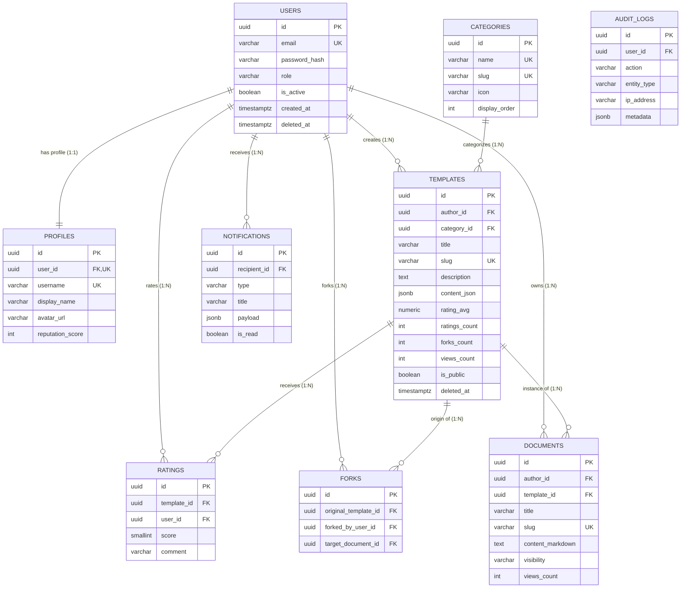

# 🗄️ THIẾT KẾ CƠ SỞ DỮ LIỆU — SENTIA HUB SERVICE
> Hệ quản trị: **PostgreSQL 16** | Chuẩn hóa: **3NF (Third Normal Form)** | Kiến trúc: **Clean Architecture**

---

## 🗺️ 1. SƠ ĐỒ THỰC THỂ QUAN HỆ (ERD DIAGRAM)



---

## 📑 2. DANH MỤC CÁC BẢNG & MỤC TIÊU THIẾT KẾ

| STT | Bảng | Ý nghĩa nghiệp vụ | Ràng buộc bảo toàn |
|---|---|---|---|
| 1 | `users` | Tài khoản & phân quyền (RBAC) | `email UNIQUE`, `role IN ('user', 'creator', 'admin')` |
| 2 | `profiles` | Thông tin công khai của Creator | Quan hệ 1:1 với `users`, `username UNIQUE` |
| 3 | `categories` | Phân loại template / tài liệu | `name UNIQUE`, `slug UNIQUE` |
| 4 | `templates` | Kho template cộng đồng (Sản phẩm lõi) | `JSONB` cho nội dung block, `rating_avg 0.00-5.00` |
| 5 | `documents` | Tài liệu, ghi chú chia sẻ dạng Markdown | `visibility IN ('public', 'unlisted', 'private')` |
| 6 | `forks` | Ghi nhận lượt sao chép template về dùng | `UNIQUE(original_template_id, forked_by_user_id)` chống clone spam |
| 7 | `ratings` | Đánh giá 1-5 sao | `UNIQUE(template_id, user_id)` (1 user chỉ rate 1 lần), `score 1..5` |
| 8 | `notifications` | Thông báo sự kiện (Producer-Consumer) | Hỗ trợ RabbitMQ pub/sub, cờ `is_read` |
| 9 | `audit_logs` | Nhật ký bảo mật & truy vết hệ thống | Chuẩn bị sẵn partition theo tháng |

---

## ⚡ 3. CHIẾN LƯỢC CHỈ MỤC (INDEXING STRATEGY)

1. **Composite Partial Index:**
   ```sql
   CREATE INDEX idx_templates_explore_hot 
   ON templates (category_id, rating_avg DESC, forks_count DESC)
   WHERE deleted_at IS NULL AND is_public = TRUE;
   ```
   *Mục đích:* Phục vụ trang chủ Marketplace lấy top templates nhanh nhất. Loại bỏ 100% bản ghi đã xóa hoặc private ra khỏi index tree, tiết kiệm 60% RAM.

2. **GIN Full-Text Search Index:**
   ```sql
   CREATE INDEX idx_templates_fts 
   ON templates USING GIN (to_tsvector('english', title || ' ' || coalesce(description, '')))
   WHERE deleted_at IS NULL AND is_public = TRUE;
   ```
   *Mục đích:* Tìm kiếm từ khóa tức thì trong < 3ms không cần Elasticsearch.
